<!-- LTeX: language=spanish -->

# Objetivos

En esta práctica instalaremos y configuraremos dos máquinas virtuales de Ubuntu Server mediante VMWare. En particular, pondremos a punto una instalación de Apache, PHP, MySQL, SSH; así como la interfaz de red necesaria para comunicar ambas máquinas con el host y entre ellas mismas.

Para ver que todo funciona correctamente, usaremos la herramienta `curl` con el fin de solicitar una pequeña página web específica de cada VM. De esa forma, comprobaremos que Apache está propiamente configurado.

Esta documentación se encuentra disponible en [Github](http://github.com/Asmilex/SWAP)

# Arrancando la máquina virtual

Antes de comenzar, debemos instalar ambos sistemas en **VMWare**. Se intentó hacerlo en VirtualBox, pero un `Kernel panic - not syncing: Attempted to kill the idle task` no me permitía iniciarlo. ¿Quizás sea debido a que estoy en Windows 11 insiders, y no se lleva bien con VirtualBox? Como alternativa probé con Hyper-V, pero los 8GB de RAM de mi portátil no permitía iniciar la máquina.

Empecemos con la creación de las máquinas. Como el proceso es análogo, mostraremos únicamente fotos de la segunda máquina, la correspondiente a `m2-amilmun`.

El usuario será `amilmun`, y la contraseña será `Swap1234`, como se indica en el guion. Aparte de la distribución de teclado, puesto que utilizo ANSI y debo configurarla a *US international con teclas muertas*, no se cambia ningún parámetro por defecto.

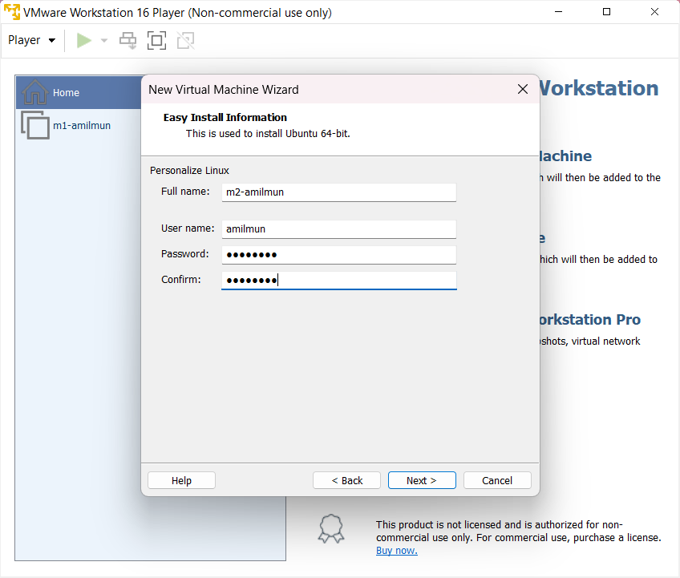
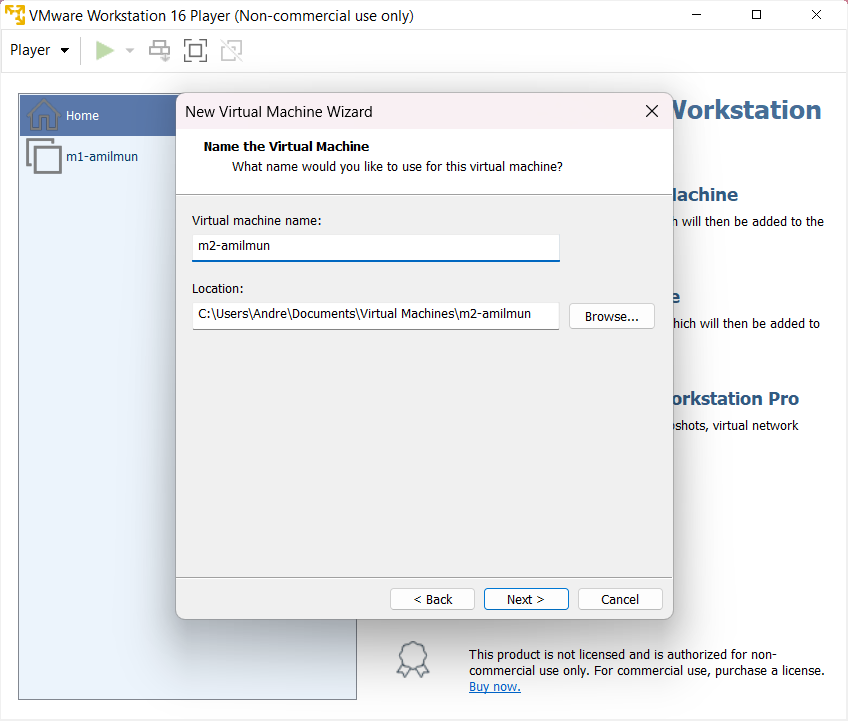
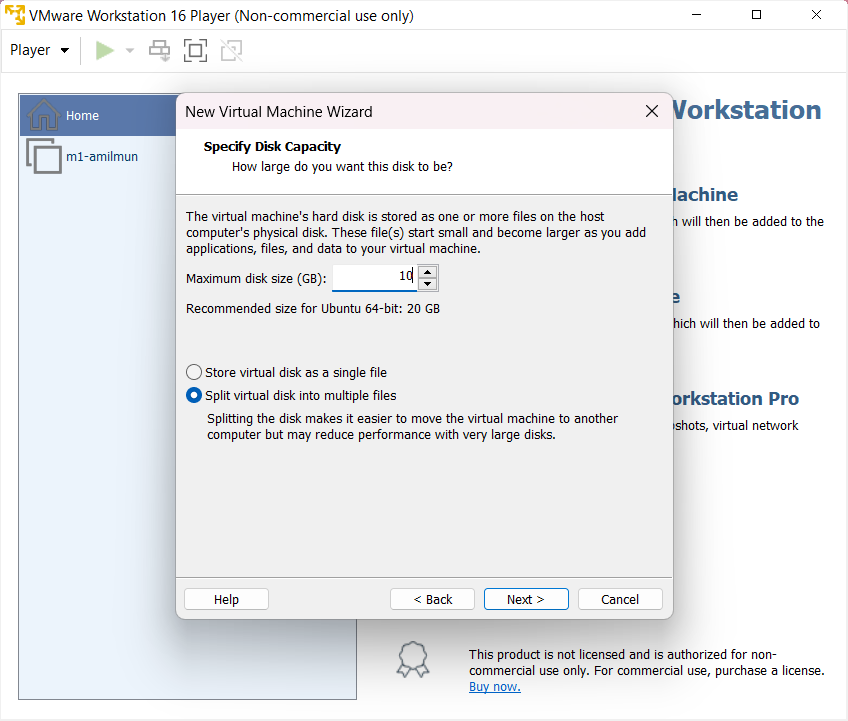
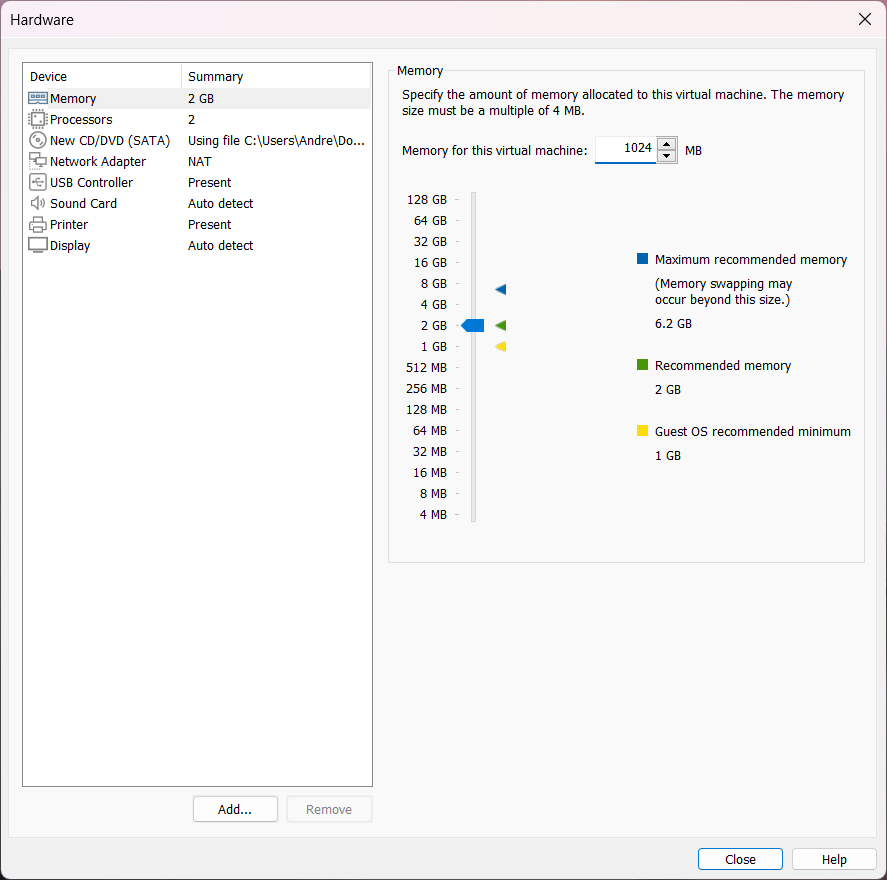
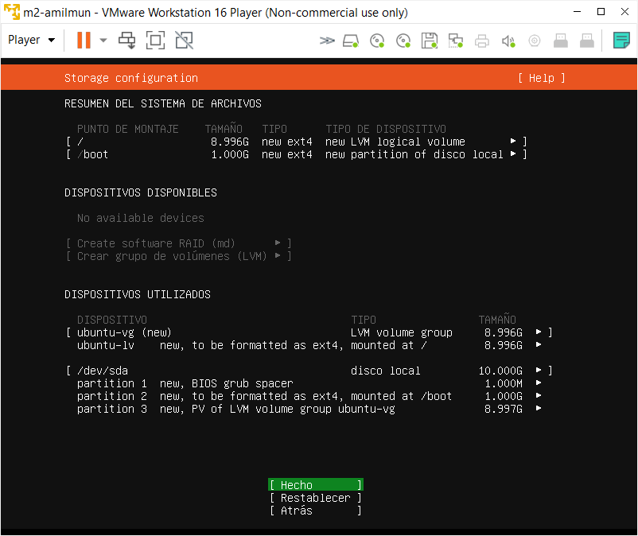
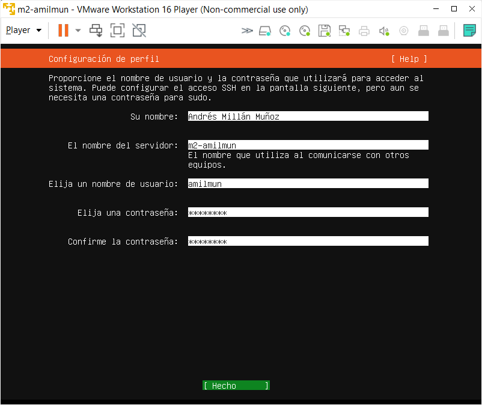

# Programas básicos

## LAMP

En el instalador no figuraba la opción para instalar LAMP, así que [usaremos `tasksel`](https://ubuntu.com/server/docs/lamp-applications#:~:text=LAMP%20Applications-,Overview,Management%20Software%20such%20as%20phpMyAdmin.) para hacerlo ahora:

```bash
sudo apt-get install tasksel
sudo tasksel install lamp-server
```

Si hacemos `apache2 -v`, vemos que aparece la versión:

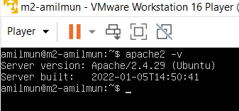

Podemos comprobar que se está ejecutando con `ps aux | grep apache`:

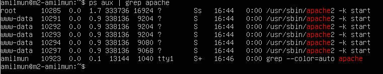

## cURL

**cURL está instalado por defecto**, así que no será necesario ponerlo a mano.

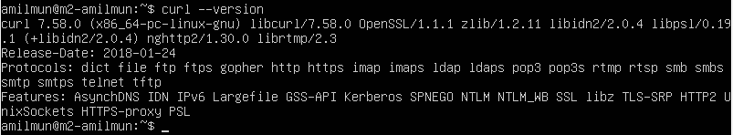

### Parámetros de cURL

#### Métodos de petición

Podemos especificar el tipo de petición que estamos haciendo con cURL. Por defecto, se utiliza `GET`. Si queremos utilizar otro tipo, podemos usar `-X` después del comando `curl`. Por ejemplo: `curl -X POST {url}`. Se puede mandar información gracias a `-d`. Al usarlo, no será necesario poner `-X POST`, [puesto que se infiere](https://daniel.haxx.se/blog/2015/09/11/unnecessary-use-of-curl-x/).

#### Especificar la versión de http

Usando la opción `-0` o `--http1.0`, le decimos a cURL que queremos utilizar la versión 1.0 de http. Alternativamente, se puede usar `--http1.1` o `--http2`.

#### Redireccionando la salida

Por defecto, cURL escribe los contenidos a `stdout`. Este comportamiento se puede modificar usando `-o {archivo}`. Por ejemplo, si quisiéramos guardar [el resultaod de la salida] al conectarnos a  nuestras máquinas, podemos escribir

```bash
curl http://192.168.49.128/swap.html -o log_curl.txt
```

#### Especificar el puerto

Para [especificar el puerto](https://stackoverflow.com/questions/20434620/can-curl-make-a-connection-to-any-tcp-ports-not-just-http-https) que se utilizará en la conexión, podemos usar `curl http://example.com:puerto`.

#### JSON

Una de las utilidades principales de cURL es la posibilidad de [enviar y recibir datos](https://reqbin.com/req/c-dwjszac0/curl-post-json-example) en formato JSON.

Para recuperar un JSON, podemos usar el comando `curl -X GET -H "Content-Type: application/json"`.

Mientras que para mandarlo, utilizamos `-d` seguido del JSON que queramos adjuntar.

#### Cookies

Esta herramienta permite [añadir cookies](https://catonmat.net/cookbooks/curl/set-cookies) a las peticiones que hagamos. Para ello, basta con utilizar el parámetro `-b` o `--cookie`

```bash
curl -b '{nombre_cookie}={valor}' {url}
```

Por ejemplo, si queremos mandarle la sesión activa a la dirección: `curl -b 'session=amilmun' https://localhost/...`.

Para añadir varias cookies en la misma orden, basta con poner `-b cookie` todas las veces que necesitemos.

Se pueden guardar las cookies en disco con la opción `-c nombre_archivo.txt`. De esta forma, podremos reutilizarlas usando `-b nombre_archivo.txt`

## Apache

La carpeta de [configuración para Apache](https://www.howtodojo.com/install-apache-mysql-php-lamp-stack-on-ubuntu-15-04/) se encuentra en `/etc/apache2`, siendo el archivo principal de configuración `/etc/apache2/apache2.conf`.

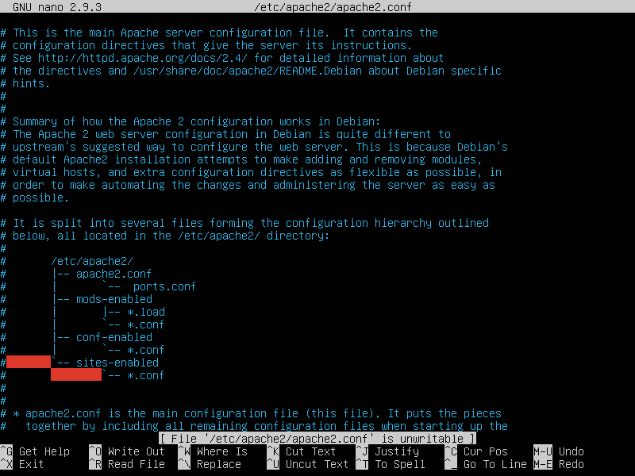

En este archivo, podemos [cambiar algunos parámetros](https://bitacoralinux.es/configuracion-de-apache2-conf/) como el archivo de configuración de puertos (por defecto, `Include ports.conf`), el nivel de logs, el timeout, ServerRoot...

Para alojar los archivos `.html`, se utiliza por defecto el directorio `/var/www/html`. Más adelante mostraremos un ejemplo de uso de esta carpeta.

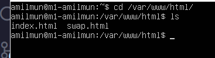

### Puertos de Apache

Si quisiéramos cambiar los puertos de Apache, debemos irnos al archivo `/etc/apache2/ports.conf` y cambiar el valor de `Listen` por el que queremos.

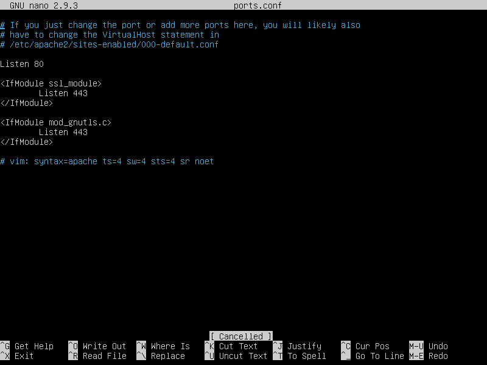

### Hosts virtuales

Los hosts virtuales [nos permiten](https://towardsdatascience.com/how-to-host-multiple-website-with-apache-virtual-hosts-4423bd0aefbf) alojar múltiples páginas web en un único servidor.

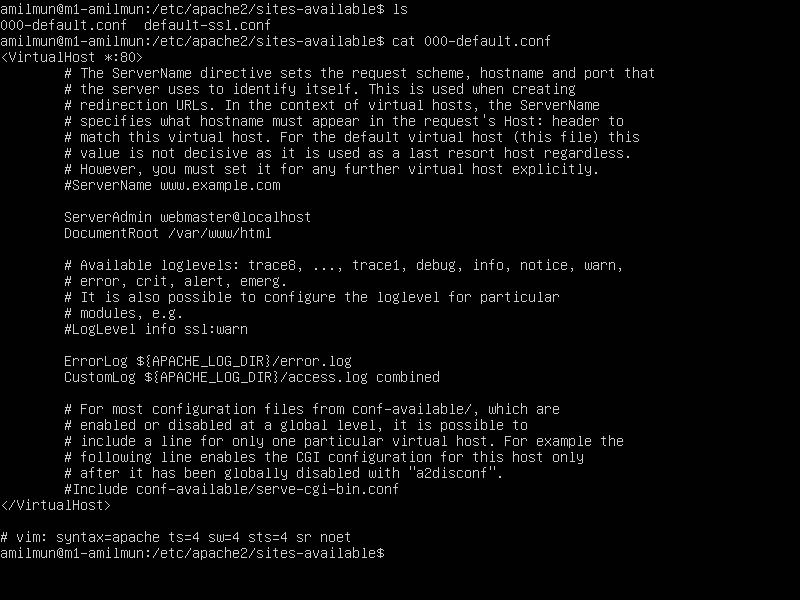

Para configurar un host virtual, debemos crear un archivo en la carpeta `/etc/apache2/sites-available/`. Este archivo debe tener el mismo nombre que el host virtual que queremos crear. Por ejemplo, si queremos crear un host virtual para la página web `example.com`, debemos crear el archivo `example.com.conf` en la carpeta `/etc/apache2/sites-available/`. Este archivo debe ser similar al ejemplo del blog enlazado al principio de esta sección:

```
<VirtualHost *:80>
    ServerAdmin email@gmail.com
    ServerName example.com
    ServerAlias www.example.com
    DocumentRoot /var/www/example.com/public_html
    <Directory /var/www/example.com/public_html>
        Options Indexes FollowSymLinks
        AllowOverride All
        Require all granted
    </Directory>
    ErrorLog ${APACHE_LOG_DIR}/error.log
    CustomLog ${APACHE_LOG_DIR}/access.log combined
    <IfModule mod_dir.c>
        DirectoryIndex index.php index.pl index.cgi index.html index.xhtml index.htm
    </IfModule>
</VirtualHost>
```

Para habilitarlo, se usar el comando `sudo a2ensite example.com.conf`. Si queremos activar los certificados SSL, usamos `sudo certbot --apache -d example.com -d www.example.com`.

Finalmente, se aplica la configuración reiniciando el servicio de Apache con `sudo systemctl restart apache2`. Con esto, debería estar listo.

### Redirección de puertos

Si se quiere redireccionar el puerto 80 al 8080, [hacemos lo siguiente](https://bobcares.com/blog/redirect-port-80-to-8080-apache/):

1. Crear el archivo `/etc/apache2/other/port8080-redirect.conf`.
2. Usar la siguiente configuración:

```
<VirtualHost _default_:80>
DocumentRoot /ruta/a/la/pagina/web
RewriteEngine On
# Redirect all requests to the local Apache server to port 8080
RewriteRule ^.*$ http://%{HTTP_HOST}:8080%{REQUEST_URI}
</VirtualHost>
```
3. Reiniciar el servicio.

## SSH

Hay una opción para poner SSH durante la instalación inicial de Ubuntu Server, así que se ha marcado.

El archivo de configuración de SSH se encuentra en `/etc/ssh/sshd_config`:

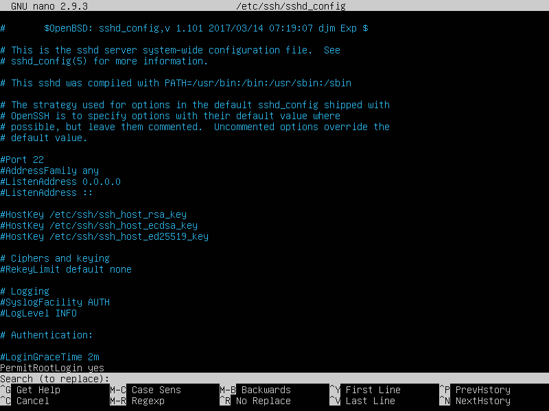

Si quisiéramos cambiar el puerto, simplemente cambiamos el parámetro `Port 22` al que queramos. De momento, lo dejaremos en el que viene por defecto.

Podemos ver un ejemplo de cómo utilizar este programa en la sección [*Uso de SSH*](#uso-de-ssh)

### Conexión sin contraseña

Si queremos loggearnos en las máquinas sin necesidad de poner la contraseña, tenemos que hacer lo siguiente:

1. Generar un nuevo par de claves SSH con `ssh-keygen`.
2. Modificar el archivo `/etc/ssh/sshd_config` poniendo `PermitRootLogin yes`.
3. Copiar la clave a la otra máquina con `ssh-copy-id`. En mi caso, para mandarla de M1 a M2, ponemos `ssh-copy-id amilmun@192.168.121.131`.

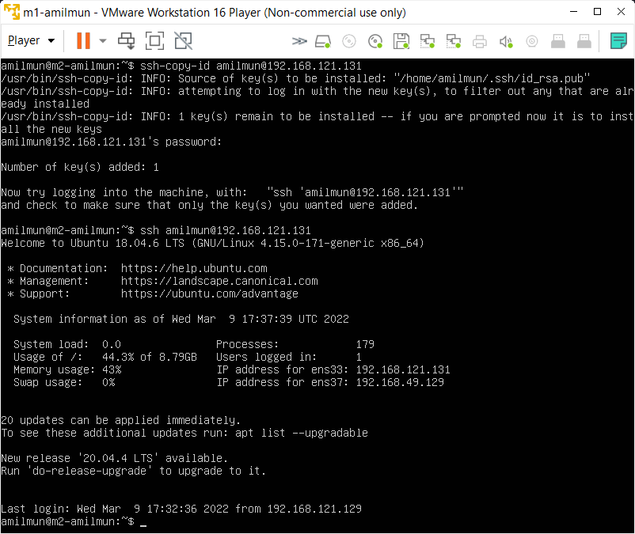

# Configurando la interfaz de red

Añadiremos un nuevo adaptador de red desde VMWare del tipo *host only*:

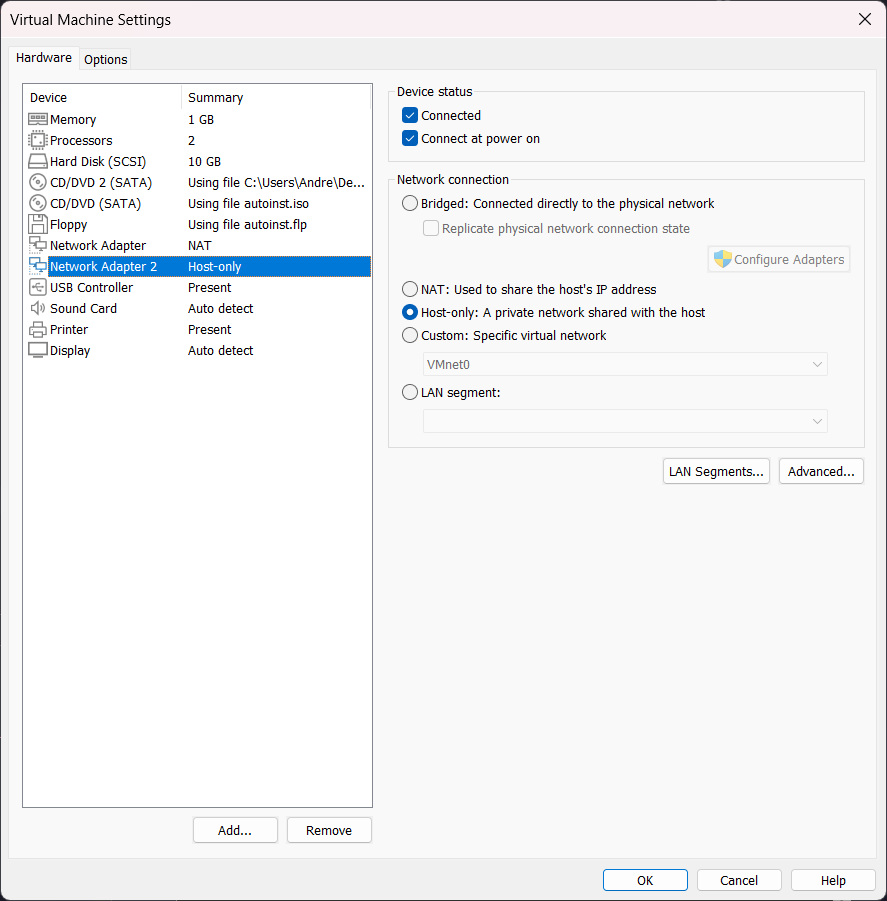

Podríamos configurar algunas opciones avanzadas del adaptador, como la MAC o simular un throttling de la red. No nos será necesario, así que no lo haremos

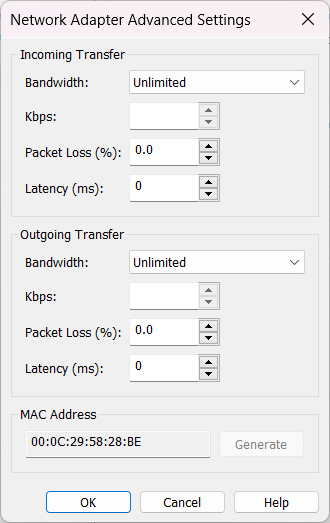

Los planes de red se encuentran almacenados en `/etc/netplan`. Vamos a añadir un nuevo adaptador `host-only` y configurarlo para fijar las IPs. En m1, será `192.168.49.128`, mientras que en m2 `192.168.49.129`. Para ello, [ponemos lo siguiente](https://linuxconfig.org/how-to-configure-static-ip-address-on-ubuntu-18-04-bionic-beaver-linux):


Vamos a crear dos páginas sencillas en las máquinas virtuales. Ponemos los siguientes archivos en `/var/www/html/swap.html`:

En m1:

```
<html>
<body>
<h1>Holaaa, soy M1!</h1>
</body>
</html>
```

Y en m2:


```
<html>
<body>
<h1>Soy M2 o/</h1>
</body>
</html>
```

Si desde el host hacemos `curl http://192.168.49.128/swap.html`, obtenemos

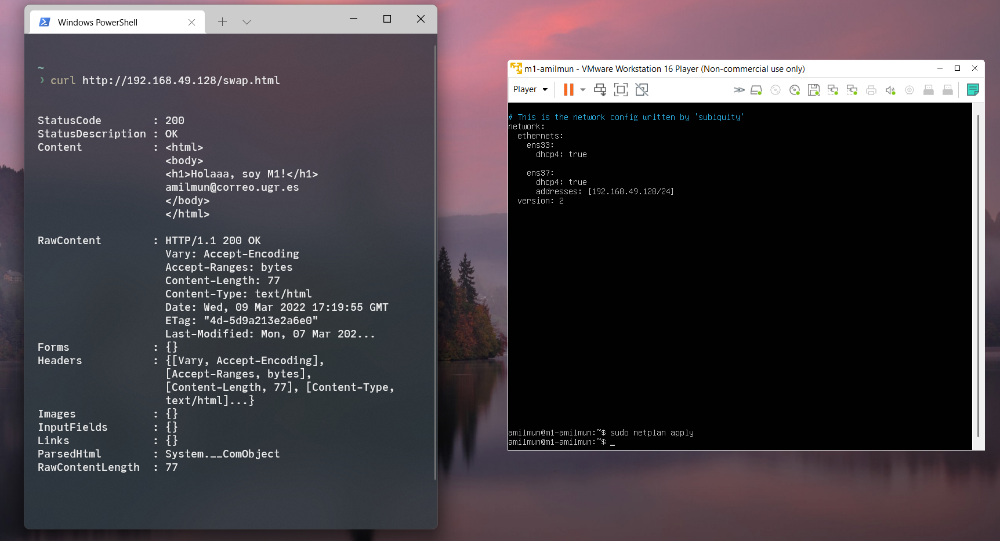

# Uso de SSH

Vamos a conectar las dos máquinas mediante SSH. Para acceder desde M1 a M2, ponemos

```
ssh 192.168.121.131
```

Y obtenemos

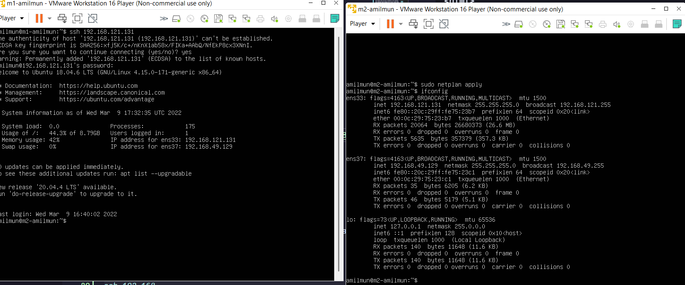
