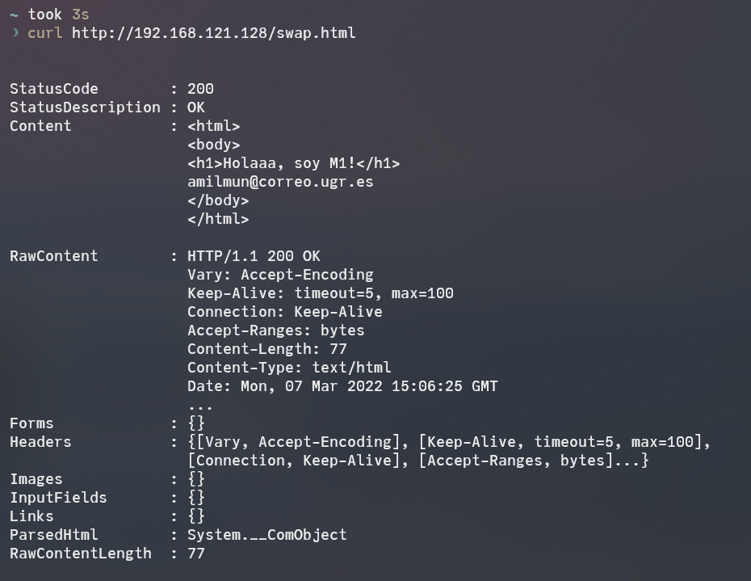

# Práctica 1

> Autor: Andrés Millán Muñoz

En esta práctica instalaremos y configuraremos dos máquinas virtuales de Ubuntu Server mediante VMWare. En particular, pondremos a punto una instalación de Apache, PHP, MySQL, SSH, así como la interfaz de red necesaria para comunicar ambas máquinas.

Para ver que todo funciona correctamente, usaremos la herramienta `curl` para solicitar una pequeña página web que crearemos. De esa forma, comprobaremos que Apache está listo. Esta página web estará alojada en las máquinas respectivas.

## Arrancando la máquina virtual

Antes de comenzar, debemos instalar ambos sistemas en VMWare. Se intentó hacerlo en VirtualBox, pero un `Kernel panic - not syncing: Attempted to kill the idle task` no me permitía iniciarlo. ¿Quizás sea debido a que estoy en Windows 11 insiders, y no se lleva bien con VirtualBox? Además, probé con Hyper-V, pero los 8GB de RAM en mi portátil no permitía iniciar la máquina.

Empecemos con la creación de las máquinas. Como el proceso es análogo, mostraremos únicamente fotos de la segunda máquina, la correspondiente a `m2-amilmun`.

El usuario será `amilmun`, y la contraseña será `Swap1234`, como se indica en el guion. No hay que cambiar demasiados parámetros del instalador. Se usarán los que vienen por defecto.

## Programas básicos

### LAMP

En el instalador no figuraba la opción para instalar LAMP, así que [usaremos `tasksel`](https://ubuntu.com/server/docs/lamp-applications#:~:text=LAMP%20Applications-,Overview,Management%20Software%20such%20as%20phpMyAdmin.) para hacerlo ahora:

```bash
sudo apt-get install tasksel
sudo tasksel install lamp-server
```

Si hacemos `apache2 -v`, vemos que aparece la versión:

> TODO foto

Podemos comprobar que se está ejecutando con `ps aux | grep apache`:

> TODO foto

### cURL

cURL está instalado por defecto, así que no será necesario ponerlo a mano.

## Configurando la interfaz de red

Por fortuna, VMWare asigna una red *host only* [por defecto]https://geek-university.com/configure-host-only-networking/#:~:text=In%20host%2Donly%20networking%2C%20a,on%20the%20host%20operating%20system., así que no nos será necesario configurar nada más del programa.

Los planes de red se encuentran almacenados en `/etc/netplan`. Vamos a configurar el que viene por defecto para fijar las IPs. En m1, será `192.168.121.128`, mientras que en m2 `192.168.121.129`. Para ello, [ponemos lo siguiente](https://linuxconfig.org/how-to-configure-static-ip-address-on-ubuntu-18-04-bionic-beaver-linux):

```

```


## Contectándolas

Vamos a crear dos páginas sencillas en las máquinas virtuales. Ponemos los siguientes archivos en `/var/www/html/swap.html`:

En m1:

```
<html>
<body>
<h1>Holaaa, soy M1!</h1>
</body>
</html>
```

Y en m2:


```
<html>
<body>
<h1>Soy M2 o/</h1>
</body>
</html>
```

Si desde el host hacemos `curl http://192.168.121.128/swap.html`, obtenemos

