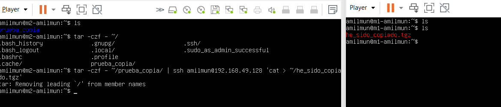
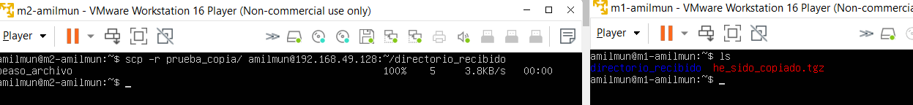
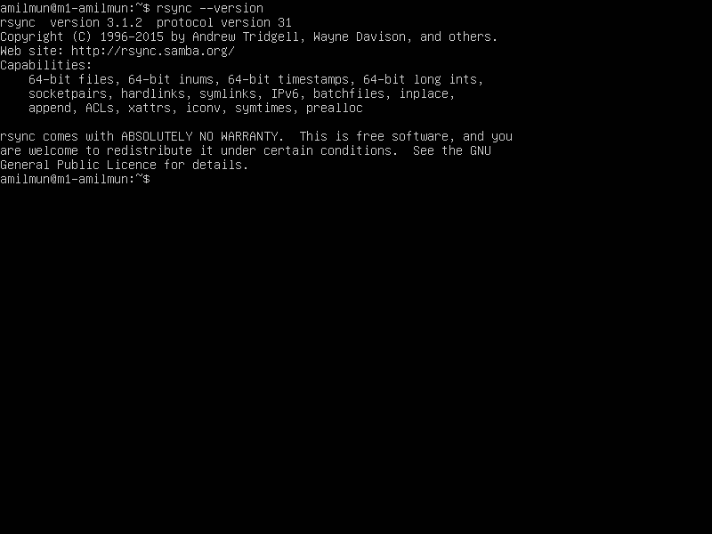
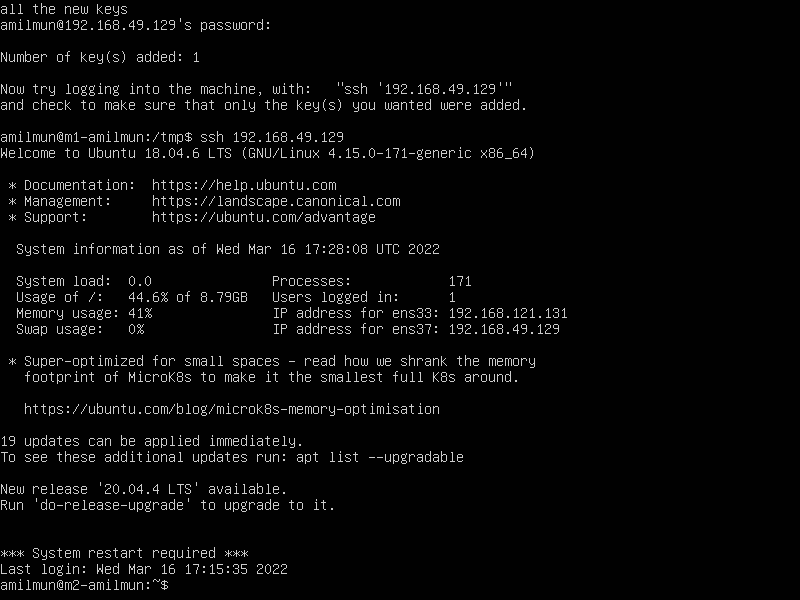

En esta práctica vamos a automatizar la copia de archivos de una máquina virtual a otra. Para ello, usaremos las herramientas SSH, rsync y crontab. Veremos cómo configurar los respectivos programas para llevar a cabo esta tarea.

# Copiando archivos de una máquina a otra

Tenemos varias opciones para traspasar archivos de una máquina a otra.

Una de ellas es usando pipelines: se comprime un directorio y se redirige la salida a ssh mediante un pipeline, pasando el directorio comprimido de una máquina a otra. La sintaxis sería...

```bash
tar -czf - {/path/a/directorio} | ssh {usuario}@{ip} 'cat > {/ruta/que/queramos}/{nombre_archivo}.tgz'
```



Otra opción es hacerlo en dos pasos: primero, comprimimos el directorio, y luego lo mandamos mediante `scp`:

```bash
tar -czvf {archivo_a_enviar}.tgz {/path/a/directorio}
scp {archivo_a_enviar}.tgz {usuario}@{ip}:{/ruta/}/{archivo_recibido}.tgz
```

Podemos hacerlo del tiró con

```bash
scp -r directorio {usuario}@{ip}:{/ruta/destino/}
```




# Uso de Rsync

Rsync viene instalado por defecto, así que no será necesario ponerlo a mano.



Operaremos en nuestro usuario llamado `amilmun`, así que, para facilitarnos el trabajo, vamos a darnos permisos sobre la carpeta `/var/ww`:

```bash
sudo chown -R amilmun:amilmun /var/www
```

Como dice el guion, para probar su funcionamiento, vamos a copiar un directorio de prueba de M1 a M2. Para ello, hacemos[^1](Este comando ha sido autocompletado por Copilot.)

```bash
rsync -avz {/path/a/dir} {usuario}@{ip}:{path/a/dir}
```

## Parámetros de rsync

### Excluir archivos o subdirectorios
A veces, nos interasá omitir algunos subdirectorios de la ruta que queramos copiar. Para conseguirlo, podemos hacer

```bash
rsync -avz --exclude {/path/a/subdir} {/path/a/dir/dir/} {usuario}@{ip}:{ruta/destino}
```

### Eliminar archivos que no existen en el destino

Si queremos una sincronización pura y dura, obviando cualquier archivo que existiera en el destino previamente, usamos `--delete`:

```bash
rsync -avz {/path/a/dir} --delete {usuario}@{ip}:{ruta/destino}
```

# SSH

Aunque hice la configuración de SSH en la práctica anterior, parece que no funciona correctamente. Creo que es debido a que sobreescribí las claves al mandarlas de una máquina a otra. Así que, para solucionarlo, lo vuelvo a hacer de nuevo.

```bash
ssh-keygen -b 4096 -t rsa
# Nos damos permisos de escritura como dice el guion
chmod 700 ~/.ssh/authorized_keys
ssh-copy-id 192.168.49.129 # M1 -> M2
ssh-copy-id 192.168.49.128 # M2 -> M1
```



# Automatizando la copia con Crontab

Crontab es una herramienta dedicada a la ejecución de programas en una determinada franja de tiempo. Cada minuto, revisará su archivo de configuración, vigilando si ha llegado el momento correcto de ejecutar alguna orden específica. El archivo de configuración se encuentra en `/etc/crontab`.

Nosotros usaremos crontab desde M1 para sincronizar los contenidos de la carpeta `/var/www`, duplicando así la página web en M2. La página [crontab.guru](https://crontab.guru/every-1-hour) resulta muy útil para configurar el programa.

Añadimos la línea

```bash
# Execute crontab every hour to copy /var/www to M2
0 * * * * rsync -avz /var/www amilmun@192.168.49.129:/var/www
```

# Cosas que tengo que decir:

- Ya hice lo de SSH copy id
- IP m1: `192.168.49.128`, m2: `192.168.49.129`.

# Herramientas usadas

1. [Crontab.guru](https://crontab.guru/)
2. [TLDR pages](https://tldr.sh/)
3. https://linuxize.com/post/how-to-exclude-files-and-directories-with-rsync/