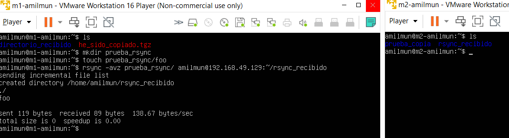
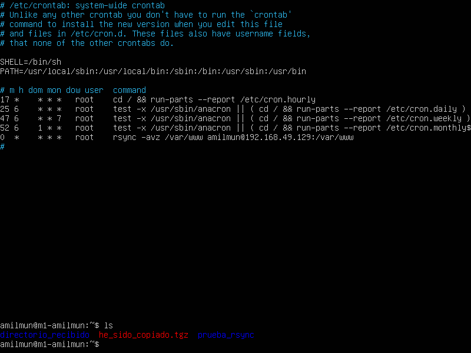

En esta práctica vamos a automatizar la copia de archivos de una máquina virtual a otra. Para ello, usaremos las herramientas SSH, rsync y crontab. Veremos cómo configurar los respectivos programas para llevar a cabo esta tarea.

> **Nota**: las IPs de las máquinas son `192.168.49.128` (M1) y `192.168.49.129` (M2).

# Copiando archivos de una máquina a otra

Hay varias formas de traspasar archivos de una máquina a otra.

Una de ellas es usando pipelines: se comprime un directorio y se redirige la salida a ssh mediante un pipeline, pasando el directorio comprimido de una máquina a otra. La sintaxis sería

```bash
tar -czf - {/path/a/directorio} | ssh {usuario}@{ip} 'cat > {/ruta/que/queramos}/{nombre_archivo}.tgz'
```


Otra opción es hacerlo en dos pasos: primero, comprimimos el directorio, y luego lo mandamos mediante `scp`:

```bash
tar -czvf {archivo_a_enviar}.tgz {/path/a/directorio}
scp {archivo_a_enviar}.tgz {usuario}@{ip}:{/ruta/}/{archivo_recibido}.tgz
```

Podemos hacerlo del tirón con

```bash
scp -r directorio {usuario}@{ip}:{/ruta/destino/}
```


## Parámetros de `scp`

Aunque no nos serán necesarios, `scp` tiene varios parámetros útiles. Por ejemplo:

- `-P` especifica el puerto en el host remoto.
- `-v` activa el modo verboso.
- `-o {ssh_options}` permite especificar algunos parámetros de ssh. Alguno de estos son la compresión, el timeout, puerto, usuario, etc...
- `-C` activa la compresión. Se lo pasa a ssh.

## Parámetros de `tar`

Al igual que con `scp`, no nos importan demasiado los diferentes parámetros de `tar`. Sin embargo, este programa es muy complejo, y permite cambiar su comportamiento de maneras muy diferentes. Entre las opciones más destacables, se encuentran:

- `c`: crea un nuevo archivo comprimido.
- `v`: muestra verbosamente el progreso.
- `f {nombre_de_archivo}`: especifica el nombre del archivo.
- `x`: extrae el comprimido.
- `u` añade archivos, pero solo los que sean más nuevos que los que se encuentran en el comprimido.
- `--exclude`: excluye los archivos que se especifiquen.

Se puede encontrar un uso de la herramienta resumido [en este enlace](https://www.computerhope.com/unix/utar.htm), así como en [tldr pages](http://tldr.sh)


# Uso de Rsync

Rsync viene instalado por defecto, así que no será necesario ponerlo a mano.


Operaremos en nuestro usuario llamado `amilmun`, así que, para facilitarnos el trabajo, vamos a darnos permisos sobre la carpeta `/var/www`:

```bash
sudo chown -R amilmun:amilmun /var/www
```

Como dice el guion, para probar su funcionamiento, vamos a copiar un directorio de prueba de M1 a M2. Para ello, hacemos

```bash
rsync -avz {/path/a/dir} {usuario}@{ip}:{path/a/dir}
```



La opción `-avz` se usa para transferir un [`a`]rchivo comprimido (*[`z`]ipped*) en modo [`v`]erboso.

## Parámetros de rsync

### Excluir archivos o subdirectorios
A veces, nos interasá omitir algunos subdirectorios de la ruta que queramos copiar. Para conseguirlo, podemos hacer

```bash
rsync -avz --exclude {/path/a/subdir} {/path/a/dir/dir/} {usuario}@{ip}:{ruta/destino}
```

### Eliminar archivos que no existen en el destino

Si queremos una sincronización pura y dura, obviando cualquier archivo que existiera en el destino previamente, usamos `--delete`:

```bash
rsync -avz {/path/a/dir} --delete {usuario}@{ip}:{ruta/destino}
```

### Otros parámetros

Sin ningún orden en particular, aquí presento una lista de algunas opciones interesantes:

- `-hP` muestra un [`p`]rogreso más entendible por un [`h`]umano.
- `L` resuelve *softlinks*.
- `u` solo transfiere archivos más nuevos que los presentes.
- Para cambiar de puerto de `ssh`, puedes usar `-e 'ssh -p {puerto}'`.
- `--dry-run` simula la transferencia pero no la realiza. De esta manera, podemos comprobar que nuestra configuración es correcta.


# SSH

Aunque hice la configuración de SSH en la práctica anterior, parece que no funciona correctamente. Creo que es debido a que sobreescribí las claves al mandarlas de una máquina a otra. Así que, para solucionarlo, lo vuelvo a hacer de nuevo.

```bash
ssh-keygen -b 4096 -t rsa
# Nos damos permisos de escritura como dice el guion
chmod 700 ~/.ssh/authorized_keys
ssh-copy-id 192.168.49.129 # M1 -> M2
ssh-copy-id 192.168.49.128 # M2 -> M1
```


Se puede evitar usar `ssh-copy-id` copiando manualmente la clave en el servidor. La siguiente forma utiliza `cat` para lograrlo:

```bash
cat ~/.ssh/id_rsa.pub | ssh {usuario}@{host-remoto} 'cat >> ~/.ssh/authorized_keys'
```

Alternativamente, `scp` consigue lo mismo:

```bash
scp ~/.ssh/id_rsa.pub {usuario}@{host-remoto}:~/.ssh/authorized_keys
```

Nosotros no necesitaremos usar ninguna de estas dos formas. A fin de cuentas, `ssh-copy-id` encapsula `scp` para hacerlo más intuitivo.


## Parámetros

### ssh-keygen

Este programa permite una cantidad de parámetros importante. Se puede modificar considerablemente su comportamiento. No obstante, la mayoría de ellos están enfocados a la seguridad, como es natural. Algunos de estos son:

- `-f {nombre_de_archivo}`: especifica el nombre del archivo.
- `-p -f {nombre_de_archivo}`: cambia la passphrase de una clave.
- `-t {algoritmo} -a {rondas}`: especifica el tipo de clave. Por ejemplo, `-t ed25519 -a 100` genera una clave usando ed25519 con 100 rondas.
- `-b {bits}`: especifica el número de bits. En los comandos de arriba, usamos `-b 4096`, lo cual dice que tiene 4096 bits.
- Se pueden añadir comentarios con `-C {comentario}`.
- `-R {host_remoto}` permite eliminar las claves de un host. Esto puede ser útil si se sabe que las claves han sido actualizadas.

### ssh-copy-id

Este programa no tiene tantos parámetros útiles. Los dos que más destacan son:

- `-i {certificado}`: copia el certificado pasado como argumento en vez de tus propias claves.
- `-p`: especifica el puerto.

# Automatizando la copia con Crontab

Crontab es una herramienta dedicada a la ejecución de programas en una determinada franja de tiempo. Cada minuto, revisará su archivo de configuración, vigilando si ha llegado el momento correcto de ejecutar alguna orden específica. El archivo de configuración se encuentra en `/etc/crontab`.

Nosotros usaremos crontab desde M1 para sincronizar los contenidos de la carpeta `/var/www`, duplicando así la página web en M2. La página [crontab.guru](https://crontab.guru/every-1-hour) resulta muy útil para configurar el programa. Ahí se pueden encontrar las diferentes formas de especificar la fecha.

Añadimos la línea

```bash
0 * * * * rsync -avz /var/www amilmun@192.168.49.129:/var/www
```



## Parámetros de crontab

De la misma manera que con los anteriores programas, vamos a listar una lista de parámetros interesantes de `crontab` sin ningún orden en particular:

- `-e`: edita el archivo de crontab para el usuario actual.
- `-e -u {usuario}`: igual que el anterior, pero especificando un usuario en particular.
- `crontab {archivo}`: reemplaza el archivo de crontab con el que se ha pasado como argumento.
- `-l` mira la lista de tareas de cron del usuario actual.
- `r`: elimina todas las tareas de cron del usuario actual.


# Referencias

1. [Crontab.guru](https://crontab.guru/)
2. [TLDR pages](https://tldr.sh/)
3. \url{https://linuxize.com/post/how-to-exclude-files-and-directories-with-rsync/}
4. \url{https://techdocs.akamai.com/netstorage/docs/use-secure-copy#secure-copy-scp-connection-options}
5. \url{https://www.tecmint.com/18-tar-command-examples-in-linux/}
6. \url{https://www.computerhope.com/unix/utar.htm}
7. \url{https://www.simplified.guide/ssh/copy-public-key}
8. Ana Buendía me ha informado sobre `--dry-run` de rsync.