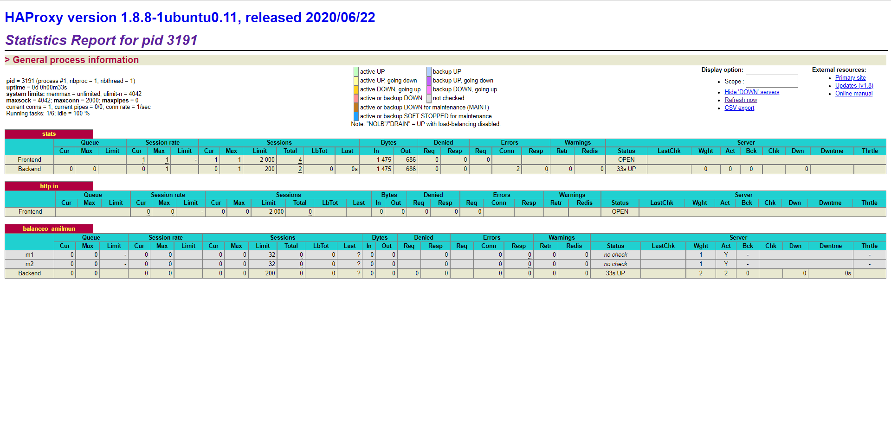
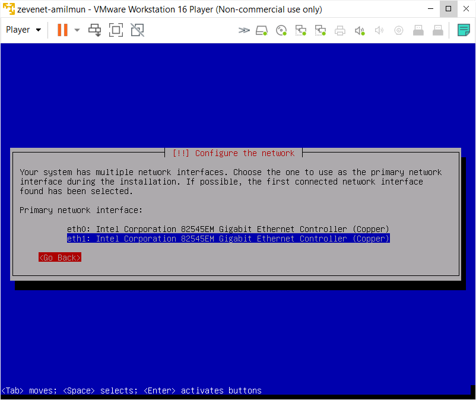
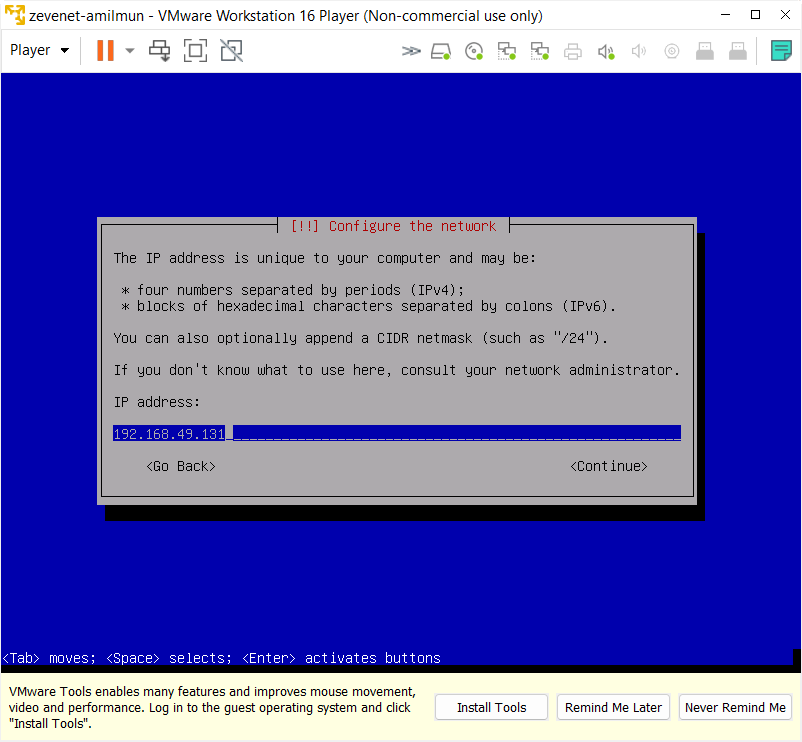
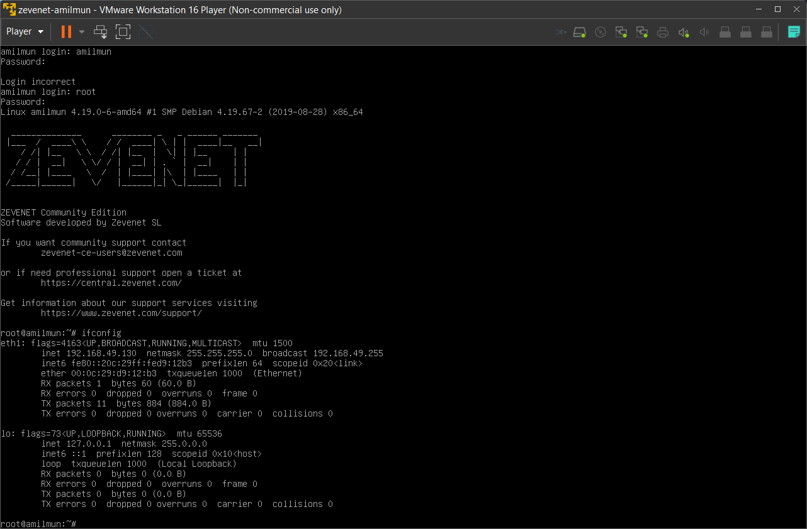
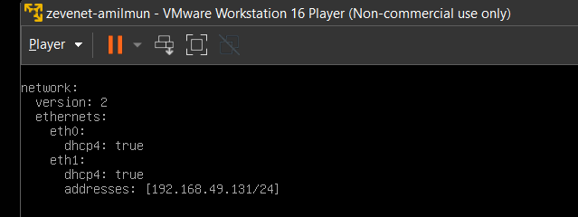
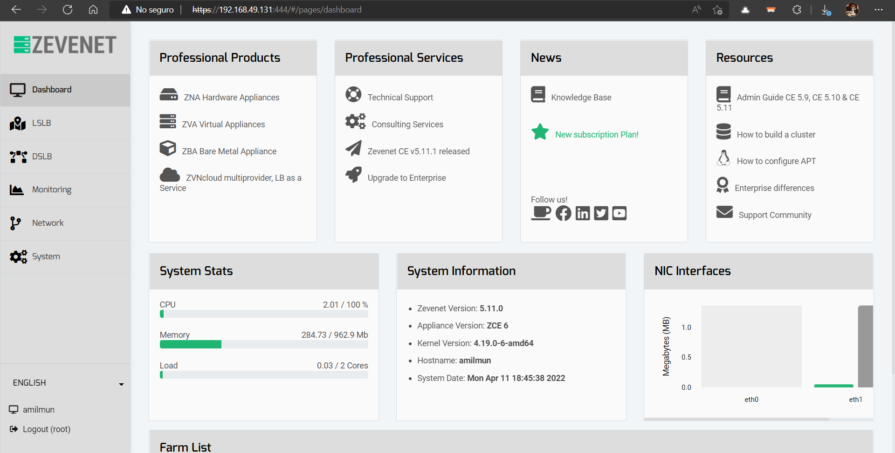
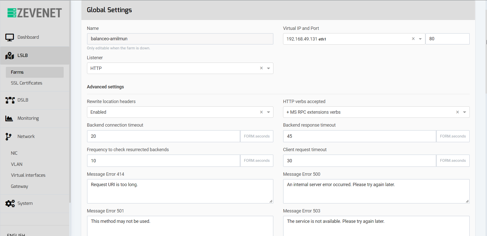
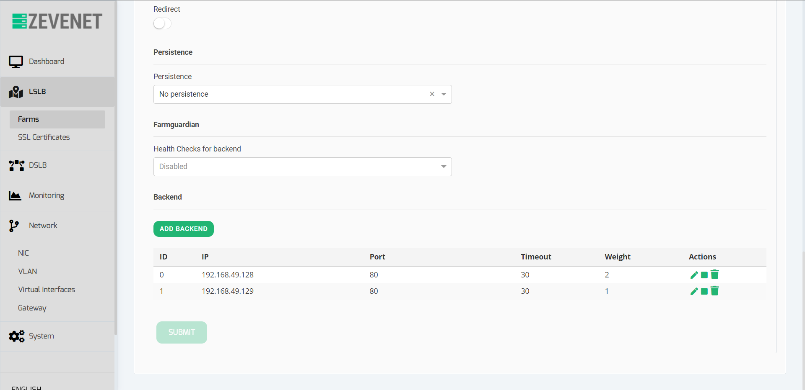
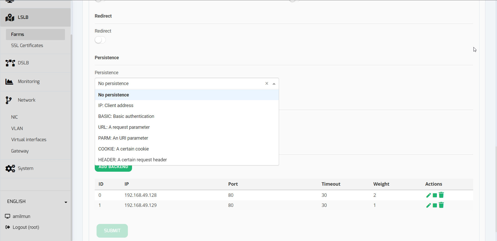
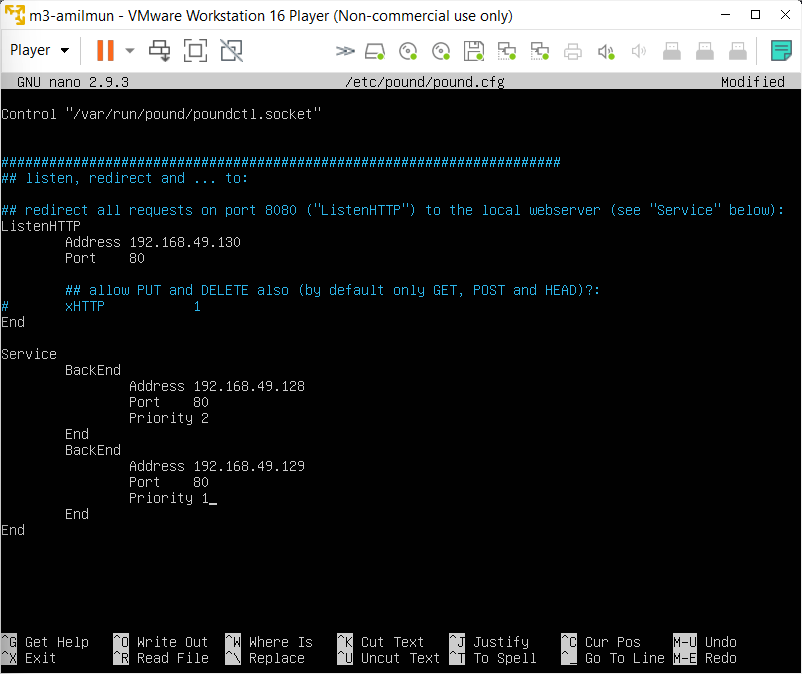

<!-- LTeX: language=spanish -->

En esta práctica vamos a configurar un balanceador de carga para gestionar nuestras máquinas virtuales. Para ello, configuraremos una nueva VM, llamada `m3`, e instalaremos distintos tipos de software. Entre ellos, `nginx`, `haproxy`, ...

La máquina `m3` se ha instalado de manera similar a las dos anteriores, a excepción de que no se ha instalado Apache. Las IPs, por tanto, quedan así:

- **M1**: `192.168.49.128`.
- **M2**: `192.168.49.129`.
- **M3**: `192.168.49.130`.

# Nginx

## Instalación y configuración básica

Para instalar `nginx`, debemos poner el siguiente comando:

```bash
sudo apt-get install nginx
```

Podemos iniciar el servicio con

```bash
sudo systemctl start nginx
```

Se puede comprobar el estado del servicio con

```bash
systemctl status nginx
```


Para que actúe como balanceador, necesitamos deshabilitar la funcionalidad de servidor web. Para ello, editamos el archivo `/etc/nginx/nginx.conf`, comentado la línea

```bash
# include/etc/nginx/sites-enabled/*;
```


Ahora debemos configurar el *upstream* con las direcciones de las máquinas virtuales. El archivo pertinente se encuentra en `/etc/nginx/conf.d/default.conf`, y debe tener el siguiente contenido:

```bash
upstream balanceo_amilmun {
    server ip_m1;
    server ip_m2;
}

server {
    # configuración del server. En particular, hay que hacer incapié en...
    server_name balanceador_amilmun;

    location {
        proxy_pass http://balanceo_amilmun;
    }
}
```


Una vez se ha configurado el archivo, se reinicia el servicio con `sudo service nginx restart`. Si todo ha ido bien, no debería dar ningún error.

Usando curl desde el host, podemos comprobar que está funcionando:


## Otros tipos de configuración

La configuración anterior utiliza round robin. Podmeos cambiar a un balanceador de carga **con prioridad** usando el parámetro `weight` en `default.conf`:

```bash
upstream balanceo_amilmun {
    server ip_m1 weight = n1;
    server ip_m2 weight = n2;
}
```

Por ejemplo, si ponemos m1 con peso 2, y m2 con peso 1, quedaría de la siguiente forma:


Alternativamente, para usar un **balanceo por IP**, debemos indicar la directiva `ip_hash`:

```bash
upstream balanceo_amilmun {
    ip_hash;
    server ip_m1;
    server ip_m2;
}
```


Por último, podemos **mantener las conexiones activas** con `keepalive`. Para ello, usamos `keepalive {valor}`. Este `valor` limita el número de conexiones activas en idle almacenadas en cada máquina. Si se alcanza esta cifra, se cierra la conexión con la IP menos usada.


### Otros parámetros

Todos estos valores se pone tras la IP del servidor en el upstream:

- `weight = {valor}`: indica el peso en la ponderación de la máquina.
- `max_fails = {valor}`: indica el número de fallos que se pueden tener en la conexión de la máquina antes de que se cierre.
- `fail_timeout = {valor}`: indica el periodo máximo de tiempo que debe ocurrir para que entre en efecto `max_fails`. Su valor por defecto es 10s.
- `down`: indica que la máquina está caída. Está pensado para utilizarse con `ip_hash`.
- `backup`: indica que la máquina está pensada para ser un respaldo. Así, si el resto no está disponible por algún motivo, entra en efecto.

Un ejemplo de configuración final sería el siguiente:


# Haproxy

A continuación, instalaremos y configuraremos `haproxy`, de manera similar a `nginx`.

Antes de comenzar, debemos deshabilitar `nginx`, puesto que en caso contrario, ambos programas estarían luchando por el mismo puerto. Podemos conseguirlo con

```bash
sudo service nginx stop  # solo para esta sesión
sudo systemctl disable nginx
```

### Instalación y configuración básica

Para instalar `haproxy`, debemos escribir el siguiente comando:

```bash
sudo apt-get install haproxy
```

Habilitamos el servicio con

```bash
sudo systemctl start haproxy
# Alternativamente
sudo service haproxy start
```


El archivo de configuración se encuentra en `/etc/haproxy/haproxy.cfg`. Haremos una configuración muy similar a la de `nginx`. Para conseguirlo, debemos editar el archivo, escribiendo lo siguiente:


De esta forma, hemos creado un frontend que recibe conexiones http desde el puerto 80, y se las manda al backend `balanceo_amilmun`. Este backend tiene dos máquinas (m1 y m2), soportando cada máquina un número máximo de conexiones (`maxconn`) de 32 usuarios.

Para comprobar que funciona corerctamente, podemos hacer `curl 192.168.49.130/swap.html`. Dado que la salida es la misma que la que tuvimos con `nginx`, omitiré el pantallazo.

### Haproxy con ponderación

Podemos configurar haproxy con ponderación usando el parámetro `weight {peso}`:


### Otras opciones de Haproxy

Como era de esperar, haproxy tiene muchas opciones diversas de configuración. En esta sección vamos a describir algunas de ellas; las que resulten más destacables.

- La clave `global` permite evitar la redundancia de código en el archivo de configuración. Se aplica tanto a backend como a frontend.
- La clave `defaults` tiene el mismo efecto, pero para los backends.
- Con respecto al backend:
  - Se puede seleccionar el tipo de balanceo con `balance {clave}`. Por defecto, se usa `roundrobin`.
  - Podemos inyectar una cookie utilizada por el balanceador para distribuir las solicitudes futuras al mismo server.


# Estadísticas

Una de las ventajas que ofrece `haproxy` es la facilidad para habilitar las estadísticas del balanceador. Para conseguirlo, modificamos la configuración, dejándola de la siguiente manera:


Podemos acceder a la página desde el navegador entrando en `http://192.168.49.130:9999/stats`:




Algunas de las modificaciones interesantes que podemos hacer son las siguientes:
- Se puede añadir la clave `stats refresh 10s` al archivo de configuración para decirle que refresque cada 10 segundos.
- `stats admin if TRUE` hace un bypass del login. Podría ser útil para debuggear.
- El timeout por defecto es 10s. Se puede cambiar con `stats timeout {n}s`.

La descripció de cada columna se puede hallar en [esta entrada del blog de Haproxy](https://www.haproxy.com/blog/exploring-the-haproxy-stats-page/). Resulta especialmente útil como manual.


# Go-between

El siguiente balanceador que usaremos será `gobetween`.

Como antes, debemos deshabilitar cualquier otro balanceador que estuviera activo. En nuestro caso, ahora mismo es `haproxy`.

Debemos instalarlo [a mano](https://github.com/yyyar/gobetween/wiki/Installation):

```bash
mkdir gobetween
cd gobetween
curl -s https://api.github.com/repos/yyyar/gobetween/releases | grep browser_download_url | grep linux_amd64 | cut -d '"' -f 4 | head -n 1 | wget -i -
tar -zxvf *.tar.gz
nano config/gobetween.toml
sudo gobetween -c config/gobetween.toml
```

El archivo por defecto que viene está bastante completo. De hecho, tiene un ejemplo de tamaño considerable dentro del propio `.toml`.

Las que usaremos serán:

```toml
...
[metrics]
enabled = true
...

[servers]
[servers.balanceo_aamilmun]
bind = "192.168.49.130:80"
protocol = "tcp"
balance = "roundrobin"

max_connections = 10000
client_idle_timeout = "10m"
backend_idle_timeout = "10m"
backend_connection_timeout = "2s"

    [servers.balanceo_aamilmun.discovery]
    kind = "static"
    static_list = [
      "192.168.49.128:80 weight=2",
      "192.168.49.129:80 weight=1"
    ]

    [servers.balanceo_amilmun.healthcheck]
    fails = 1
    passes = 1
    interval = "2s"
    timeout = "1s"
    kind = "ping"
    ping_timeout_duration = "500ms"
```


- El peso se puede cambiar con `{url_server:puerto} weight={peso}`.
- `leastconn` obliga a gobetween a seleccionar el backend con menos conexiones.
- `max_connections = {valor}` dicta el número máximo de conexiones al servidor. Otros parámetros relacionados son `client_idle_timeout`, `backend_idle_timeout` y `backend_connection_timeout`.
- En el apartado `[servers.balanceo_amilmun.healthcheck]` se puede configurar parámetros similares al anterior. No entraré en detalle, puesto que viene en el código anterior bien puesto; y son muy similares a los del resto de balanceadores.

# Zevenet

Para instalar Zevenet debemos proceder de manera algo diferente. Esto no es un programa como tal; sino una distribución. Proporcionan una ISO o un contenedor Docker. Nosotros optaremos por la primera opción.

Es importante añadir las tarjetas de red antes de iniciar la instalación del sistema. De esta forma, Zevenet configurará correctamente la red. En la instalación, debemos marcar la tarjeta `eth1`:



Para la IP usaremos `192.168.49.131`. Aunque lo pondremos en el instalador, realmente, esto es irrelevante, puesto que luego lo configuraremos con netplan. El resto de parámetros tomarán el valor que viene por defecto. El hostname y la contraseña se ha configurado para ser los mismos que en el resto de máquinas.



Una vez instalado, nos podemos loggear con usuario `root` y contraseña `Swap1234`.



Aplicamos el siguiente netplan:



Podemos configurar el balanceador accediendo desde el navegador a la página `https://192.168.49.131:444/`, usando los mismos credenciales que utilizamos para loggearnos:



Para crear el balanceo, podemos irnos a LSLB -> Farms. Creamos una nueva granja, añadiendo los backend M1 y M2:




Con esto, el balanceador está funcionando. La persistencia del servicio se puede activar con la opción `persistence`:



# Pound

Pound es un servidor proxy reverso y balanceador de carga sencillo.

La instalación de este programa será algo diferente. Pound no se encuentra en los repositorios de Ubuntu server 18.04, pero podemos bajarnos directamente el archivo `.deb`:

```bash
sudo apt-get update && sudo apt-get upgrade
wget http://launchpadlibrarian.net/384724960/init-system-helpers_1.54_all.deb
wget http://archive.ubuntu.com/ubuntu/pool/universe/p/pound/pound_2.8-2_amd64.deb
sudo dpkg -i init-system-helpers_1.54_all.deb
sudo dpkg -i pound_2.8-2_amd64.deb
```

En el proceso hemos tenido que actualizar `init-system-helpers`, puesto que no cumplía el requisito de que la versión debe ser mayor o igual a 1.54.

El archivo de configuración se encuentra en `/etc/pound/pound.cfg`. Una configuración básica para nuestro escenario sería la siguiente:


Para iniciarlo, primero modificamos el archivo `/etc/default/pound` poniendo `startup=1`. Luego, hacemos `systemctl restart pound.service`. Nos pide loggearnos, por lo que usamos nuestra contraseña del usuario (`Swap1234`).

Añadiendo el parámetro `Priority {valor entre 1 y 9}`, modificamos los pesos.



Algunos parámetros interesantes que podemos modificar son...

- `Alive {valor (s)}`: es el periodo de tiempo que el servidor esperará a que el backend responda.
- `Client {valor (s)}`: es el periodo de tiempo que el servidor esperará a que el cliente responda. Pasado este tiempo, el servidor cortará la conexión.
- `TimeOut {valor (s)}`: periodo de tiemp que Pound esperará al BackEnd para una respuesta.
- Se puede configurar un backend de emergencia con `Emergency`. Este se activará cuando el resto falle. La configuración sería idéntica a la que hemos hecho con `BackEnd` (a excepción de las IPs).
-

# Análisis comparativo

Para comprobar cuál de todos los balanceadores que hemos instalado se comporta mejor, usaremos la herramienta `ab`. Los benchmarks que usaremos serán los siguientes:

| Clientes | Número de peticiones concurrentes |
|:---------|:----------------------------------|
| 10000    | 10                                |
| 10000    | 20                                |
| 5000     | 10                                |

Desde el host, haremos `ab -l -n {clientes} -c {peticiones} -i http://192.168.49.130/swap.html`

# Bibliografía

- https://www.cyberciti.biz/faq/systemd-systemctl-view-status-of-a-service-on-linux/
- https://linuxhint.com/what-is-keepalive-in-nginx/
- https://documentation.suse.com/smart/linux/html/reference-systemctl-enable-disable-services/index.html
- https://www.haproxy.com/blog/the-four-essential-sections-of-an-haproxy-configuration/#:~:text=There%20are%20four%20essential%20sections,routed%20to%20your%20backend%20servers.
- https://support.ptc.com/help/thingworx/platform/r9/es/index.html#page/ThingWorx/Help/ThingWorxHighAvailability/HAProxyExample.html
- https://www.haproxy.com/blog/exploring-the-haproxy-stats-page/
- https://cbonte.github.io/haproxy-dconv/1.7/configuration.html
- https://www.wikiwand.com/es/Pound_-_Servidor_Proxy_Reverso
- https://www.apsis.ch/pound.html
- https://www.tecmint.com/setting-up-pound-web-server-load-balancing-in-linux/
- https://help.ubuntu.com/community/Pound