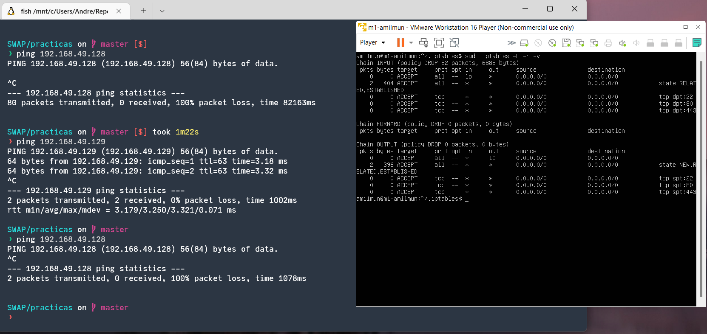

<!-- LTeX: language=es -->

En esta práctica, vamos a poner a punto la seguridad de la granja web. Para conseguirlo, instalaremos un certificado SSL para el acceso de HTTPS, y configuraremos un cortafuegos.

Como siempre, las IPs de las máquinas son las siguientes:

- **M1**: `192.168.49.128`.
- **M2**: `192.168.49.129`.
- **M3**: `192.168.49.130`.

# Fe de erratas

Antes de comenzar la práctica, voy a explicar por qué todas mis prácticas anteriores eran incorrectas, y por qué me acabo de dar cuenta.

Intentando hacer scp de M1 a M2 para copiar el certificado, me he encontrado con un error extraño. El archivo no se copiaba. O, mejor dicho, se copiaba a la misma máquina aún poniendo la IP correcta. Haciendo más pruebas, nos dimos cuenta de que M1 podía hacer ping a M2, pero M2 no podía a M1. Y desde el localhost, todo funcionaba bien.

¿El error? El netplan estaba mal configurado.


Aún limitando la IP a una sola, `dchp4: true` asigna una adicional. Esta no figura en `ifconfig`, pero sí en `ip a`.

Es por estos motivos que SSH dio problemas al pasar de la práctica 1 a la 2; `rsync` no funcionó en la práctica 2; y es posible que no estuviéramos haciendo balanceo de carga en la práctica 3. Podría ser que desde una máquina externa sí funcione correctamente como es el caso de localhost, pero no es seguro.

Desgracias de la configuración de un sever.


# Certificado SSL

Generaremos un certificado SSL autofirmado desde la máquina M1, copiándolo a M2 mediante ssh.

## Emisión del certificado

Primero, debemos activar el módulo SSL de Apache:

```bash
sudo a2enmod ssl
sudo systemctl restart apache2 # Debemos reiniciar el servicio
```

Creamos el directorio de certificados:

```bash
sudo mkdir /etc/apache2/ssl
```

Generemos un certificado autofirmado, llamado `apache_amilmun.crt`, con clave `apache_amilmun.key` y con una duración de 1 año. Debemos introducir también los datos del certificado apropiados en la creación:

```bash
sudo openssl req -x509 -nodes -days 365 -newkey rsa:2048 –keyout /etc/apache2/ssl/apache_amilmun.key -out /etc/apache2/ssl/apache_amilmun.crt
```


Ahora debemos configurar correctamente apache para que use el certificado. Para lograrlo, editamos el archivo `/etc/apache2/sites-available/default-ssl.conf`, y agregamos:


```bash
SSLCertificateFile /etc/apache2/ssl/apache_amilmun.crt
SSLCertificateKeyFile /etc/apache2/ssl/apache_amilmun.key
```


Finalmente, debemos activar `default-ssl` y reiniciar apache:

```bash
sudo a2ensite default-ssl
sudo systemctl reload apache2
```

Accediendo desde el navegador, podemos ver que se ha cargado correctamente la página


## Puesta a punto de M2 y M3

Ahora, debemos copiar el certificado generado a las máquinas M2 y M3. Usamos `scp` para lograrlo:

```bash
# M1 -> M2
sudo scp /etc/apache2/ssl/apache_amilmun.crt amilmun@192.168.49.129:/etc/apache2/ssl/apache_amilmun.crt
sudo scp /etc/apache2/ssl/apache_amilmun.key amilmun@192.168.49.129:/etc/apache2/ssl/apache_amilmun.key

# M1 -> M3
# Desde M3, podemos hacer
sudo scp -r amilmun@192.168.49.128:/etc/apache2/ssl /home/amilmun/ssl
```

Cuando lo hagamos, en M2 debemos editar la configuración, activar el módulo y reiniciar Apache, como en M1; mientras que en M3, añadiremos los parámetros pertinentes a la configuración de Nginx:

```
listen 443 ssl;
ssl on;
ssl_certificate /home/amilmun/ssl/apache_amilmun.crt;
ssl_certificate_key /home/amilmun/ssl/apache_amilmun.key;
```


De esta forma, se puede acceder a `https://192.168.49.130`. Muestra un error de certificado, lo cual es normal; pues no está distribuido por un agente de confianza.

## Opciones avanzadas

### Comprobación del certificado

Podemos comprobar el estado del certificado gracias a `openssl`. El comando sería

```bash
openssl s_client -connect {ip máquina}:443 -showcerts
```

Por ejemplo, para M1 se obtiene


### Configuración adicional de Apache

https://www.digitalocean.com/community/tutorials/how-to-create-a-self-signed-ssl-certificate-for-apache-in-ubuntu-18-04-es

Aunque estas opciones no las acabaremos usando, exiten algunos parámetros interesantes que podemos editar.

Uno de ellos es la redirección a HTTPS desde HTTP. Para lograrlo, podemos editar la configuración `/etc/apache2/sites-avaliable/000-default.conf` del puerto 80, escribiendo

```
<VirtualHost *:80>
        Redirect "/" "https://{IP}/"
</VirtualHost>
```


# Configuración del firewall

Todo servidor que se precie debe tener un cortafuegos configurado. En esta sección, pondremos en marcha el nuestro utilizando `iptables`.


## Diseño de las reglas

El plan será denegar todo tipo de conexión por defecto, y entonces, habilitaremos las que a nosotros nos interesen. En este caso, serán las conexiones (puesto que estamos en un servidor) y el tráfico proveniente de SSH, HTTP y HTTPS.

Para ello, crearemos un script en alguna de las máquinas o el localhost con el siguiente contenido:

```bash
#!/bin/bash

# Eliminar cualquier configuración anterior
iptables -F
iptables -X

# Denegar por defecto el tráfico
iptables -P INPUT DROP
iptables -P FORWARD DROP
iptables -P OUTPUT DROP

# Habilitar conexión con el localhost (interfaz lo)
iptables -A INPUT -i lo -j ACCEPT
iptables -A OUTPUT -o lo -j ACCEPT

# Permitir conexiones
iptables -A INPUT -m state --state ESTABLISHED,RELATED -j ACCEPT
iptables -A OUTPUT -m state --state NEW,ESTABLISHED,RELATED -j ACCEPT

# Permitir SSH
iptables -A INPUT -p tcp --dport 22 -j ACCEPT
iptables -A OUTPUT -p tcp --sport 22 -j ACCEPT

# Permitir HTTP
iptables -A INPUT -p tcp --dport 80 -j ACCEPT
iptables -A OUTPUT -p tcp --sport 80 -j ACCEPT

# Permitir HTTPS
iptables -A INPUT -p tcp --dport 443 -j ACCEPT
iptables -A OUTPUT -p tcp --sport 443 -j ACCEPT
```

Este script debemos traspasarlo a cada máquina con `scp`, como hicimos con los certificados. La ruta será `/home/amilmun/.iptables/iptables_script.sh`.


Podemos ejecutarlo con `sudo ./iptables_script.sh` en cada una.

Tras ejecutarlo, podemos ver que no podemos hacer ping a M1:



Mientras que `curl` funciona perfectamente:


## Ejecución automática del script al arrancar

Ejecutar un script al inicio del sistema es sencillo. Para conseguirlo, creamos el archivo `/etc/rc.local` con el siguiente contenido:

```bash
#!/bin/sh -e
/home/amilmun/.iptables/iptables_script.sh
exit 0
```

Hacemos `sudo chmod +x /etc/rc.local` y listo.


# Referencias

- https://www.ubuntuleon.com/2016/10/cargar-un-script-al-inicio-del-sistema.html