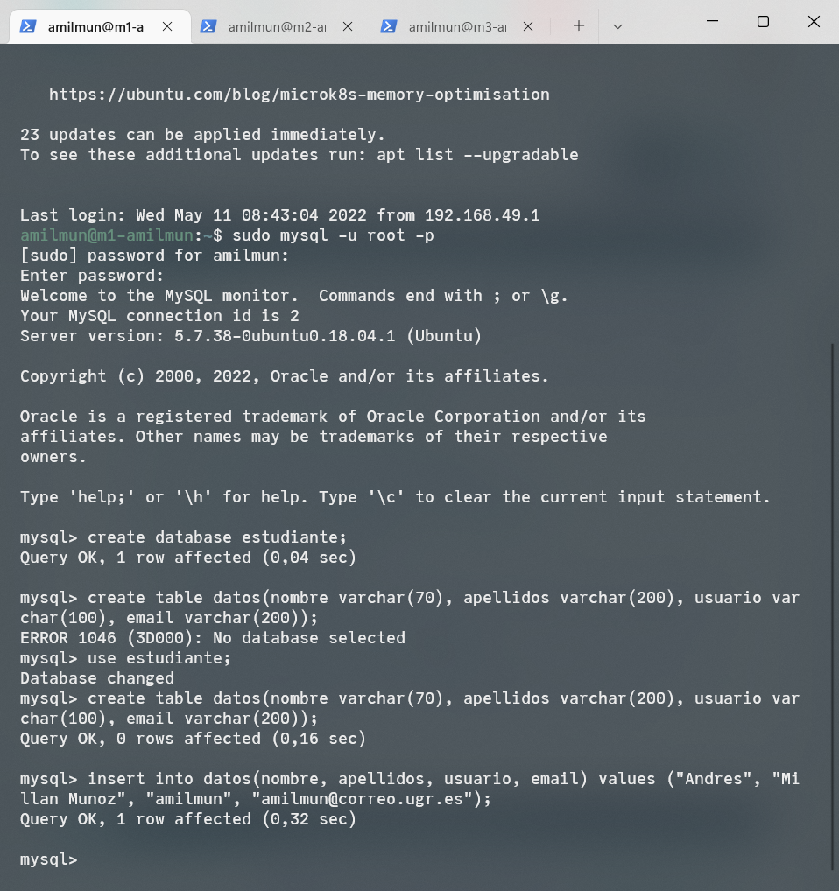
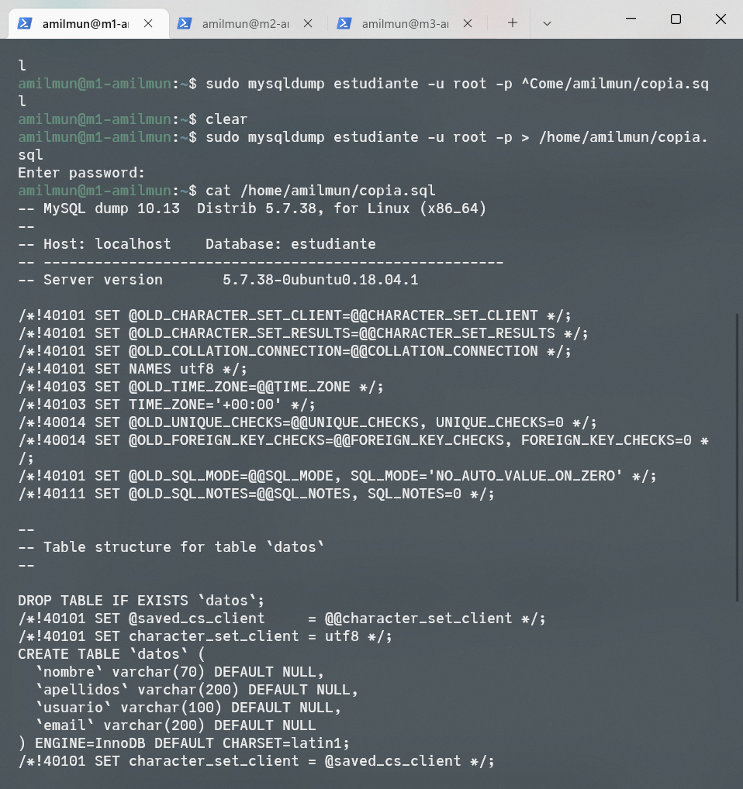
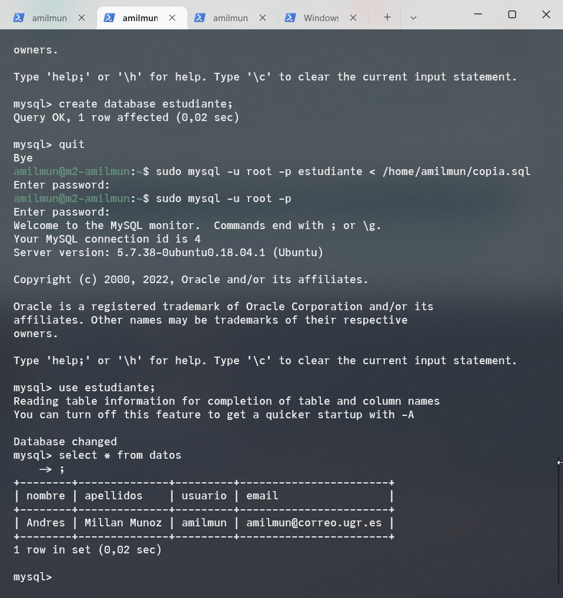

<!-- LTeX: language=es -->

En esta práctica vamos a configurar una base de datos replicada entre dos máquinas virtuales, de forma que se sincronice utilizando el paradigma maestro-esclavo.

Recordemos que las IPs de las máquinas virtuales son:

- **M1**: `192.168.49.128`.
- **M2**: `192.168.49.129`.
- **M3**: `192.168.49.130` (aunque no la usaremos en esta práctica)

# Configuración de MySQL

## Poniendo las bases de datos a punto

Primero, vamos a crear una BD de **MySQL en M1**. Para ello, nos conectamos al cliente con `sudo mysql -u root -p`. La contraseña es la misma de siempre. Una vez estemos dentro del programa, creamos una tabla de estudiantes y añadimos mi información personal dentro:

```
create database estudiante;
use estudiante;
create table datos(nombre varchar(70), apellidos varchar(200), usuario varchar(100), email varchar(200));
insert into datos(nombre, apellidos, usuario, email) values ("Andres", "Millan Munoz", "amilmun", "amilmun@correo.ugr.es");
```



Tras esto, bloqueamos la base de datos para que no se pueda modificar con `FLUSH TABLES WITH READ LOCK;`, salimos, y hacemos una copia con mysql-dump:

```
sudo mysqldump estudiante -u root -p > /home/amilmun/copia.sql
```



Por último, desbloqueamos la tabla con `UNCLOCK TABLES;` y copiamos el archivo `copia.sql` a M2 con algún método. Por ejemplo, mediante `scp`.

Ahora debemos restaurar la **base de datos en M2**. Para ello, entramos en el cliente y creamos la base de datos `estudiante`. Tras esto, hacemos

```
sudo mysql -u root -p estudiante < /home/amilmun/copia.sql
```



## Configuración del maestro-esclavo

Es el momento de cambiar los parámetros de MySQL para conseguir el paradigma deseado. Sin embargo, primero debemos hacer un par de comprobaciones:

- Mirar la versión de MySQL con `mysql -V`. En mi caso, este comando arroja `mysql  Ver 14.14 Distrib 5.7.38, for Linux (x86_64) using  EditLine wrapper`.
- Desactivar las reglas de iptables para evitar posibles quebraderos de cabeza. Podemos usar el siguiente script para ello:

```
#!/bin/bash
iptables -F
iptables -X
iptables -t nat -F
iptables -t nat -X
iptables -t mangle -F
iptables -t mangle -X
iptables -P INPUT ACCEPT
iptables -P OUTPUT ACCEPT
iptables -P FORWARD ACCEPT
```

Toca cambiar la configuración de MySQL. Los pasos son los siguientes:

1. **M1**: Abrimos el archivo `/etc/mysql/mysql.conf.d/mysqld.cnf`, comentando el `bind-address` y poniendo el `server-id = 1`. Además, ponemos a punto los logs.
2. Reiniciar MySQL.
3. **M2**: Hacemos lo mismo que en M1, pero con `server-id = 2`
4. **M2**: Reiniciar MySQL.
5. **M1**: creamos el usuario esclavo dentro de MySQL.
6. **M1**: Comprobamos el estado de Master con `SHOW MASTER STATUS;`. Esto nos arroja la posición 704.
7. **M2:** Usamos la configuración del paso 6 en MySQL.
8. **M2**: Hacemos `START SLAVE;` en M2.
9. **M1**: Reactivamos las tablas con `UNLOCK TABLES;`.
10. **M2**: Comprobamos el estado del slave con `SHOW SLAVE STATUS\G;`.


Si todo sale bien, debería aparecernos en `Seconds_Behind_Master` un número, y no el valor `NULL`. Como podemos observar en la foto del paso 10, hemos conseguido nuestro objetivo.

# Modificando iptables

Si nos fijamos en la configuración, hemos utilizado el puerto 3306 para el tráfico de MySQL. Para que nuestro cortafuegos no genere problemas, debemos añadir una excepción al script de la práctica anterior. Ponemos al final:

```
# Permitir MySQL
iptables -A INPUT -p tcp --dport 3306 -j ACCEPT
iptables -A OUTPUT -p tcp --sport 3306 -j ACCEPT
```