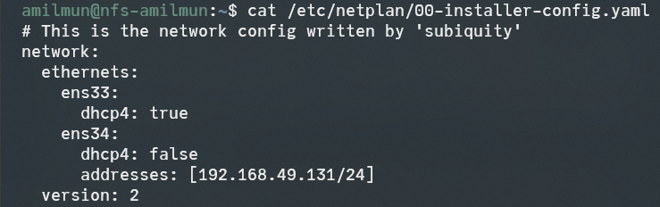
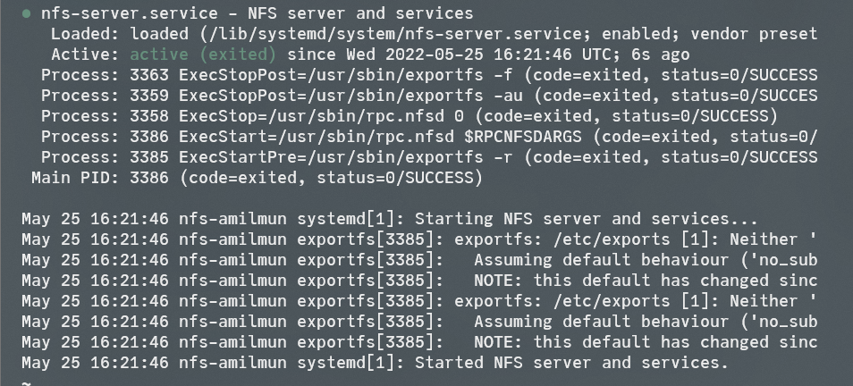
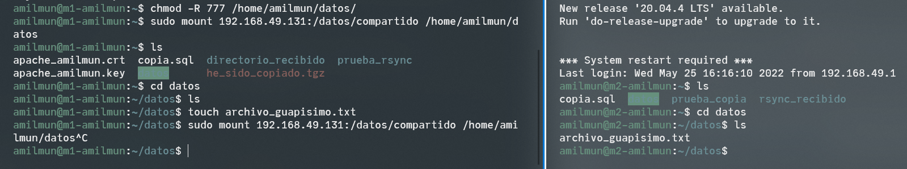
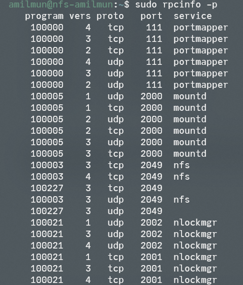
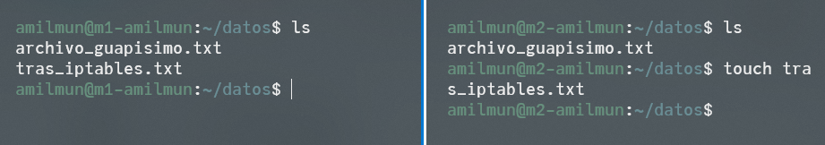

<!-- LTeX: language=es -->

Para esta última práctica vamos a configurar un servidor NFS con el fin de proporcionar espacio adicional a las máquinas del backend; las cuales actuarán como un cliente de NFS.

Las IPs de las máquinas son:

- **M1**: `192.168.49.128`.
- **M2**: `192.168.49.129`.
- **M3**: `192.168.49.130`.
- **NFS**: `192.168.49.131`.

# Creación de la máquina NFS

Nuestro primer objetivo será crear una nueva máquina virtual que haga las veces de NFS. Para ello, utilizamos la misma ISO de Ubuntu server de las anteriores máquinas.

El proceso de instalación es análogo, así que no lo detallaremos. Lo único que merece la pena destacar es que el usuario será `amilmun` y su contraseña `Swap1234`, al igual que en los casos anteriores. Además, editaremos el netplan para fijar en la segunda tarjeta la IP a `192.168.49.131/24` y dchp a `false`.



Tras esto, instalaremos los programas necesarios para tener en marcha NFS. Podemos hacerlo con `sudo apt-get install nfs-kernel-server nfs-common rpcbind`. Ahora creamos la carpeta compartida con el resto de máquinas. Para ello:

```sh
sudo mkdir /datos
sudo mkdir /datos/compartido
sudo chown nobody:nogroup /datos/compartido
sudo chmod -R 777 /datos/compartido
```

Para que M1 y M2 sean capaces de acceder, debemos añadir las siguientes líneas al fichero `/etc/exports`:

```sh
/datos/compartido/ 192.168.49.128(rw) 192.168.49.129(rw)
```

Reiniciando el servicio de NFS, podemos comprobar que está funcionando:

```sh
sudo systemctl restart nfs-kernel-server
```



# M1 y M2 como clientes

Para que M1 y M2 puedan acceder a la carpeta, necesitamos proveerles de algunos paquetes necesarios. Los podemos conseguir con `sudo apt-get install nfs-common rpcbind`.

Creamos una carpeta donde montar los datos compartidos:

```sh
# M1 y M2
mkdir /home/amilmun/datos
chmod -R 777 /home/amilmun/datos
```

Montar el servidor NFS es tan sencillo como hacer

```sh
sudo mount 192.168.49.131:/datos/compartido /home/amilmun/datos
```

Si ponemos un archivo en la carpeta, veremos que se sincroniza en todas las máquinas:



En este momento existe un problema con la configuración: cada vez que reiniciemos las máquinas hará falta montar de nuevo la carpeta de `datos`. Podemos solucionarlo añadiendo la siguiente línea en el fichero `/etc/fstab`:

```sh
192.168.49.131:/datos/compartido /home/amilmun/datos/ nfs auto,noatime,nolock,bg,nfsvers=3,intr,tcp,actimeo=1800 0 0
```

# Seguridad del servidor NFS

Para reforzar la seguridad del servidor, bloquearemos mediante iptables todo el tráfico a excepción del que esté relacionado con NFS. No obstante, añadiré SSH puesto que lo estoy utilizando.

Antes de crear el script, debemos cambiar la configuración de mountd y nlockmgr. Por defecto, utilizan puertos dinámicos. Para la configuración que sabemos hacer nosotros con iptables esto no nos beneficia. Aunque no es el método óptimo, podemos cambiarlo a puertos estáticos:

- Para **mountd**, añadimos al archivo `/etc/default/nfs-kernel-server` cambiamos la línea `RPCMOUNTDOPTS="--manage-gids"` por `RPCMOUNTDOPTS="--manage-gids -p 2000"`
- Para **nlockmgr**, crearemos un archivo llamado `nfs-ports.conf` en la carpeta `/etc/sysctl.d`, que contenga los parámetros `fs.nfs.nlm_tcpport = 2001` y `fs.nfs.nlm_udpport = 2002`. Una vez esté listo, reiniciamos el servicio con dicha configuración (`sudo sysctl --system /etc/init.d/nfs-kernel-server restart`).

Podemos comprobar que está funcionando con el comando

```sh
sudo rpcinfo -p localhost
```

En mi caso fue necesario reiniciar la máquina para la configuración de nlockmgr hiciera efecto.



Ahora estamos en condiciones de diseñar las reglas. Creamos un script similar a los de las anteriores prácticas, especificando las IPs de las máquinas M1 y M2 [@iptables-2]:

```sh
#!/bin/bash

# Eliminar config anterior
iptables -F
iptables -X

# Denegar todo el tráfico
iptables -P INPUT DROP
iptables -P FORWARD DROP
iptables -P OUTPUT DROP

# Habilitar conexión con localhost
iptables -A INPUT -i lo -j ACCEPT
iptables -A OUTPUT -o lo -j ACCEPT

# Permitir SSH
iptables -A INPUT -p tcp --dport 22 -j ACCEPT
iptables -A OUTPUT -p tcp --sport 22 -j ACCEPT

# NFS
iptables -A INPUT -p tcp --dport 2049 -s 192.168.49.128,192.168.49.129 -j ACCEPT
iptables -A OUTPUT -p tcp --sport 2049 -d 192.168.49.128,192.168.49.129 -j ACCEPT

# Portmapper
iptables -A INPUT -p tcp --dport 111 -s 192.168.49.128,192.168.49.129 -j ACCEPT
iptables -A OUTPUT -p tcp --sport 111 -d 192.168.49.128,192.168.49.129 -j ACCEPT

# Mountd, nlockmgr
iptables -A INPUT -p tcp --dport 2000 -s 192.168.49.128,192.168.49.129 -j ACCEPT
iptables -A INPUT -p tcp --dport 2001 -s 192.168.49.128,192.168.49.129 -j ACCEPT
iptables -A INPUT -p udp --dport 2002 -s 192.168.49.128,192.168.49.129 -j ACCEPT
iptables -A OUTPUT -p tcp --sport 2000 -d 192.168.49.128,192.168.49.129 -j ACCEPT
iptables -A OUTPUT -p tcp --sport 2001 -d 192.168.49.128,192.168.49.129 -j ACCEPT
iptables -A OUTPUT -p udp --sport 2002 -d 192.168.49.128,192.168.49.129 -j ACCEPT
```

Podemos ver que funciona perfectamente:



# Bibliografía
